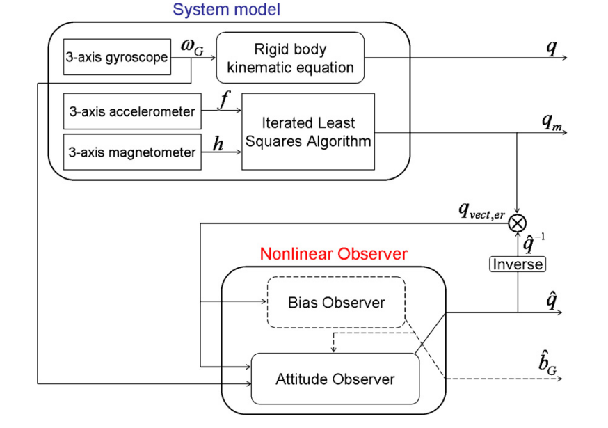
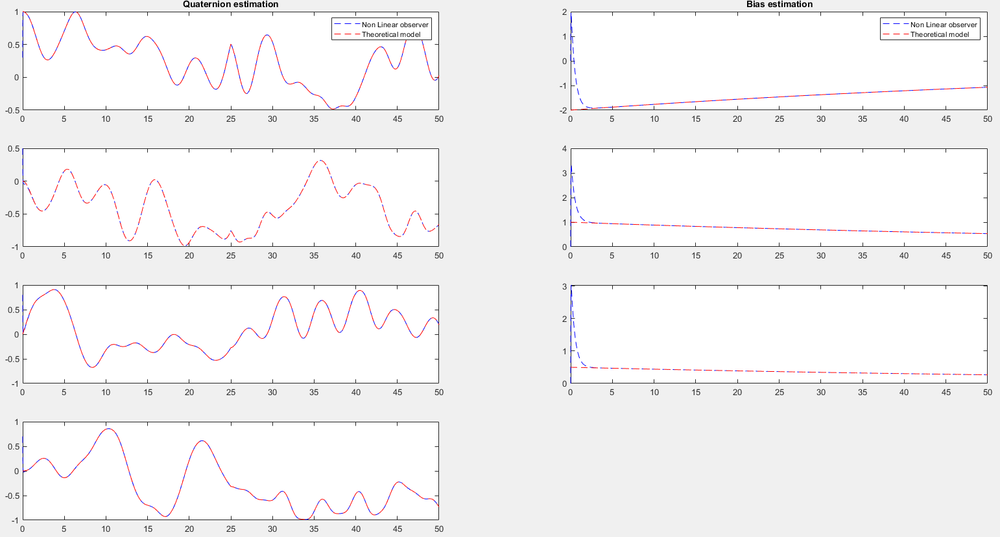

# Nonlinear Observer for attitude estimation
This repository contains the  Matlab code implementation of the research paper entitled: Posture and body acceleration tracking by inertial and magnetic sensing: Application in behavioral analysis of free-ranging animals publisheb by [Hassen Fourati](http://www.gipsa-lab.grenoble-inp.fr/page_pro.php?vid=1442), [Noureddine Manamanni](https://scholar.google.fr/citations?user=5TC6oaIAAAAJ&hl=fr), [Lissan Afilal](https://www.researchgate.net/profile/Lissan-Afilal) and [Yves Handrich
](https://www.researchgate.net/profile/Yves-Handrich). 

## Abstract 
This paper concerns body attitude (orientation) estimation for free ranging animal. The main idea of
the proposed approach combines a quaternion-based nonlinear observer with an Iterated Least Squares
Algorithm (ILSA) and exploits measurements from Micro-Electro-Mechanical-System (MEMS) sensors as
3-axis accelerometer, 3-axis magnetometer and 3-axis gyroscope to produce attitude estimates during
the entire range of the observed animal’s body movements. Moreover, the proposed observer allows
estimating the bias in gyroscope which is used to correct the angular velocity measurements in the
attitude estimation step. Since, biologists use an index of DBA for evaluating the energy consumption of
the moving animal; the resulting estimations are then used to extract the Dynamic Body Acceleration
(DBA) of the animal. Note that, this work is necessary in Bio-logging science and allows monitoring
aspects of animal’s biology (behavior, movement, and physiology) and environments. The performance
of the algorithm is theoretically proven and illustrated by an attitude estimation example. Moreover, the
efficiency of the proposed approach is shown with a set of experiments through sensor measurements
provided by an Inertial Measurement Unit (IMU). We have also included some comparison results with
another method already applied in Bio-logging field in order to point out the improvements issued from
the proposed approach. 

you can find the full paper here: https://hal.archives-ouvertes.fr/hal-00642357

## Overview of the nonlinear observer

## Estimated quaternion and bias against real quaternion and bias 

